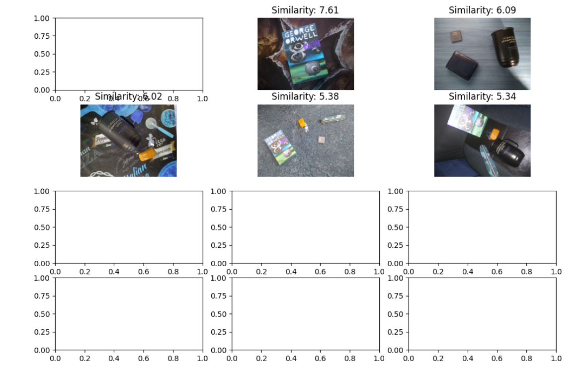
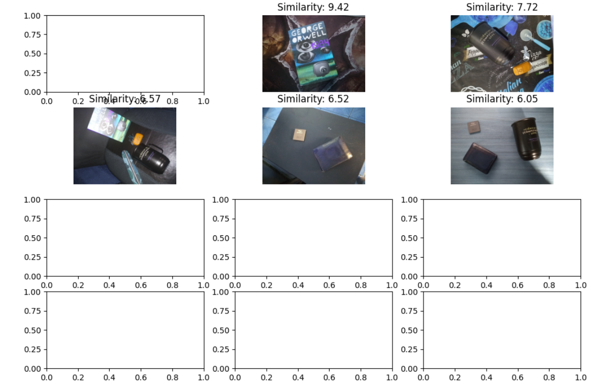
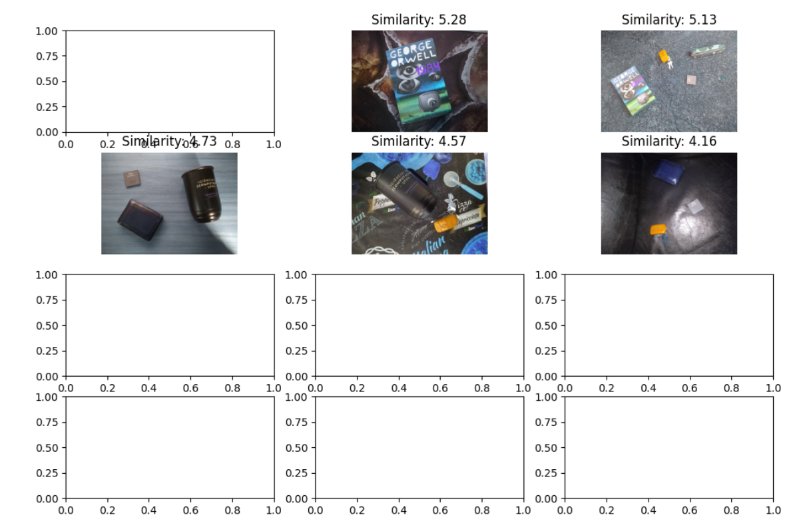

# Color Indexing baseado no algoritmo de Swain & Ballard

Feito por Anderson Frasão e Erick Eckermann

Trabalho de implementação de algoritmo para reconhecimento de objetos por cor, baseado no artigo de Swain & Ballard. Foram escolhidos 6 objetos diferentes: carteira, chave, caneca, penal, livro e um processador. Foram tiradas diversas fotos de combinações diferentes desses objetos em diversos cenários.

O algoritmo proposto por Swain & Ballard utiliza de histogramas das cores extraídos de uma base de imagens para reconhecer objetos numa imagem de entrada. Dado uma imagem de entrada com um único objeto, o algoritmo faz uma busca em todos os histogramas e reconhece as imagens da base que possuem o objeto. Esse reconhecimento é realizado por meio da comparação da intercessão entre o histograma da imagem de entrada e as imagens da base. As imagens que obtiverem a maior interseção são consideradas como contendo o objeto.

Um exemplo para o reconhecimento das chaves gera a seguinte saída:

Percebe-se que 3 das 5 imagens com maior semelhança reconheceram a chave corretamente, porém as maiores similaridades são com as imagens que não possuem a chave. Agora um exemplo buscando a carteira:

Agora somente duas imagens foram reconhecidas corretamente, porém foram as duas com menores similaridades dadas. Percebemos nesses testes um padrão onde diversos objetos e cores de fundo parecidas confundem o algoritmo, pois é difícil diferenciar objetos de mesma cor ou com o fundo com cor semelhante, já que o algoritmo se baseia na intersecção de histogramas.

Fazendo a busca pelo processador temos o seguinte resultado:

Agora por ser um objeto de tamanho menor onde não há pixels predominantes na imagem não foi obtido muito sucesso na busca, pelo fato dos pixels da cor do processador não serem em grande quantidade nas imagens. Percebe-se que a maior similaridade foi com o livro, e isso provavelmente se dá pelo fato de o livro escolhido ter uma diversa gama de cores na capa.

Em geral o algoritmo não foi eficiente, reconhecendo em média 3 imagens corretamente em cada teste, e sempre as com maiores similaridades não correspondiam. Talvez isso se dê pelo fato de o nosso algoritmo se basear no histograma da imagem inteira para calcular a interseção. Um método melhor, porém mais custoso, seria comparar os histogramas com diversos tamanhos de kernel diferentes, fazendo uma varredura na imagem em busca do objeto. Isso poderia trazer resultados mais concisos, pois os histogramas quando o kernel passasse por cima da imagem teria muita semelhança.

Em geral também podemos perceber que utilizar cores para classificação de imagens não é o mundo ideal e é muito suscetível a erros, pois objetos da mesma cor, ou cenários com cores semelhantes fazem com que os histogramas sejam não tão confiáveis.